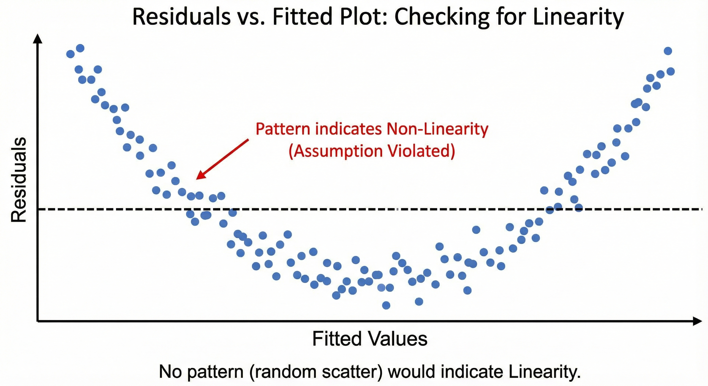
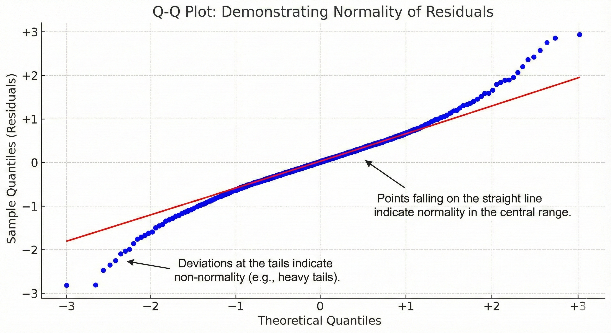
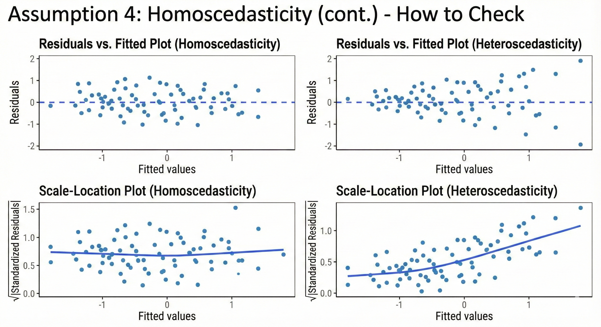

# Multivariable Linear Regression

## What is Multivariable Linear Regression?

An extension of simple linear regression that models the relationship between:

- **One continuous outcome variable** (Y)
- **Multiple predictor variables** (X₁, X₂, X₃, ..., Xₚ)

## The Model

$$Y = \beta_0 + \beta_1X_1 + \beta_2X_2 + ... + \beta_pX_p + \epsilon$$

Where:

- $\beta_0$ = intercept
- $\beta_1, \beta_2, ..., \beta_p$ = regression coefficients
- $\epsilon$ = error term

## Why Use Multivariable Regression?

**Control for Confounding**

- Adjust for variables that might distort the relationship between predictor and outcome
- Isolate the effect of each predictor while holding others constant

## Why Use Multivariable Regression?

**Improved Predictions**

- Multiple predictors often explain more variation in the outcome
- Higher R² values indicate better model fit

## Why Use Multivariable Regression?

**Understanding Complex Relationships**

- Real-world phenomena rarely depend on a single factor
- Examine simultaneous effects of multiple variables

## Interpreting Coefficients

### The Adjusted Effect

Each regression coefficient represents the **change in Y** for a **one-unit increase in that predictor**, **holding all other predictors constant**.

## Interpreting Coefficients

### Example Interpretation

If studying blood pressure with predictors: age, weight, and smoking status:

- **Age coefficient (β₁ = 0.8)**: For each additional year of age, blood pressure increases by 0.8 mmHg, adjusting for weight and smoking
- **Weight coefficient (β₂ = 0.3)**: For each additional kg, blood pressure increases by 0.3 mmHg, adjusting for age and smoking

## R² and Adjusted R²

### R² (Coefficient of Determination)

- Proportion of variance in Y explained by all predictors
- Range: 0 to 1 (or 0% to 100%)
- **Problem**: Always increases when adding more predictors, even if they're not meaningful

## R² and Adjusted R²

### Adjusted R²

$$\text{Adj } R^2 = 1 - \frac{(1-R^2)(n-1)}{n-p-1}$$

- Penalizes for adding unnecessary predictors
- More reliable for comparing models with different numbers of predictors
- Can decrease if added variables don't improve the model sufficiently

# Checking Model Assumptions

## The Four Key Assumptions

For valid inference from linear regression, we must verify:

1. **Linearity**: Relationship between X and Y is linear
2. **Independence**: Observations are independent
3. **Normality**: Residuals follow a normal distribution
4. **Homoscedasticity**: Constant variance of residuals

**Remember**: LINE assumptions (Linearity, Independence, Normality, Equal variance)

## Assumption 1: Linearity

### What Does It Mean?

The relationship between each predictor and the outcome should be linear (or appropriately transformed).

## Assumption 1: Linearity (cont.)

### How to Check

**Residuals vs. Fitted Plot**

- Plot residuals against predicted values
- Look for random scatter around zero
- **Warning signs**: Curved patterns, U-shapes, systematic trends

**Partial Residual Plots**

- Examine linearity for each predictor individually
- Useful when multiple predictors are present

## Assumption 1: Linearity (cont.)

## Assumption 2: Independence

### What Does It Mean?

Observations should be independent of each other - one observation shouldn't influence another.

### Common Violations

- **Clustered data**: Patients within hospitals, students within schools
- **Time series**: Measurements over time on same subjects
- **Spatial correlation**: Geographic proximity

## Assumption 2: Independence (cont.)

### How to Check

- Consider study design
- Plot residuals in order of data collection
- Look for patterns suggesting correlation

### Solutions

Use specialized models: mixed effects, time series, or spatial models

## Assumption 3: Normality of Residuals

### What Does It Mean?

The residuals (not the raw data!) should follow a normal distribution.

### How to Check

**Q-Q Plot (Quantile-Quantile Plot)**

- Points should fall approximately on a straight line
- Deviations at the tails indicate non-normality

## Assumption 3: Normality of Residuals (cont.)

### How to Check

**Histogram of Residuals**

- Should resemble a bell curve
- Check for skewness or multiple peaks

## Assumption 3: Normality of Residuals (cont.)

## Assumption 3: Normality of Residuals (cont.)

### How to Check

**Shapiro-Wilk Test**

- Formal hypothesis test for normality
- p > 0.05 suggests normality (but sensitive in large samples)

## Why Normality Matters (and Doesn't)

### Less Critical Than You Think

With **large sample sizes** (n > 30-40), the Central Limit Theorem protects us:

- Coefficient estimates remain unbiased
- Hypothesis tests remain approximately valid

## Why Normality Matters (and Doesn't) 

### When It Really Matters

- Small sample sizes (n < 30)
- Extreme outliers present
- Making predictions with confidence intervals

## Why Normality Matters (and Doesn't)

### Solutions for Violations

- Transform the outcome variable (log, square root)
- Use robust regression methods
- Consider non-parametric alternatives

## Assumption 4: Homoscedasticity

### What Does It Mean?

**Homoscedasticity** = constant variance of residuals across all levels of predictors

**Heteroscedasticity** = variance changes (increases or decreases) with fitted values

## Assumption 4: Homoscedasticity (cont.)

### How to Check

**Residuals vs. Fitted Plot**

- Vertical spread should be roughly constant
- **Funnel shape**: Indicates heteroscedasticity
- **Fan shape**: Variance increases with fitted values

**Scale-Location Plot**

- Plot square root of standardized residuals vs. fitted values
- Should show horizontal line with random scatter

## Assumption 4: Homoscedasticity (cont.)

## Consequences of Heteroscedasticity

### What Goes Wrong?

**Standard errors are biased**

- Confidence intervals are incorrect (too narrow or too wide)
- p-values are unreliable
- Hypothesis tests may be invalid

**Coefficient estimates remain unbiased**

- The βs are still correct on average
- But we can't trust their precision

## Consequences of Heteroscedasticity (cont.)

### Solutions

- **Transform outcome**: log, square root transformations
- **Weighted least squares**: Give less weight to high-variance observations
- **Robust standard errors**: Adjust SEs without changing coefficients

# Multicollinearity

## What is Multicollinearity?

When two or more predictor variables are **highly correlated** with each other.

### Example

In a health study predicting blood pressure:

- Height (cm) and Weight (kg) are correlated
- BMI includes both height and weight
- Using all three creates multicollinearity

## Why It's a Problem

Makes it difficult to isolate the individual effect of each correlated predictor.

## Consequences of Multicollinearity

**Unstable Coefficient Estimates**

- Small changes in data lead to large changes in coefficients
- Coefficients may have unexpected signs

## Consequences of Multicollinearity

**Inflated Standard Errors**

- Wide confidence intervals
- Non-significant results even when relationship exists

## Consequences of Multicollinearity

**Difficulty in Interpretation**

- Hard to determine which predictor is truly important
- "Holding other variables constant" becomes problematic

## What Multicollinearity Does NOT Affect

- Overall model fit (R²)
- Predictions and fitted values

## Detecting Multicollinearity

### Correlation Matrix

- Examine pairwise correlations between predictors
- Rule of thumb: |r| > 0.8 or 0.9 suggests potential problems
- **Limitation**: Only detects pairwise relationships

## Detecting Multicollinearity

### Variance Inflation Factor (VIF)

Most reliable diagnostic tool for multicollinearity.

$$VIF_j = \frac{1}{1 - R^2_j}$$

Where R²ⱼ is from regressing predictor j on all other predictors.

## Interpreting VIF Values

### VIF Interpretation Guidelines

| VIF Value | Interpretation | Action |
|--|-|--|
| VIF = 1 | No correlation | Ideal |
| 1 < VIF < 5 | Moderate correlation | Generally acceptable |
| 5 ≤ VIF < 10 | High correlation | Investigate |
| VIF ≥ 10 | Severe multicollinearity | Take action |

## Interpreting VIF Values (cont.)

### What VIF Tells Us

VIF = 5 means the standard error is √5 = 2.24 times larger than it would be without correlation.

VIF = 10 means variance is inflated 10-fold.

## Dealing with Multicollinearity

**Remove Redundant Variables**

- Drop one of the highly correlated predictors
- Keep the one with stronger theoretical justification or easier to measure

## Dealing with Multicollinearity (cont.)

**Combine Variables**

- Create a composite index or average
- Example: Combine multiple measures of socioeconomic status

## Dealing with Multicollinearity (cont.)

**Principal Components Analysis (PCA)**

- Create uncorrelated components from correlated predictors
- Loss of interpretability

## Dealing with Multicollinearity (cont.)

**Increase Sample Size**

- Reduces standard errors
- Not always feasible

## When to Worry About Multicollinearity

### It Depends on Your Goal

**Prediction**: Don't worry much

- Multicollinearity doesn't affect predictions
- R² and fitted values remain valid

## When to Worry About Multicollinearity (cont.)

### It Depends on Your Goal

**Inference and Interpretation**: Worry

- If you need to interpret individual coefficients
- If you want to understand specific predictor effects
- If testing hypotheses about specific variables

## When to Worry About Multicollinearity

### It Depends on Your Goal

**Exploratory Analysis**: Moderate concern

- Understand the correlation structure
- Be cautious with interpretation
- Report VIF values

# Interaction Terms

## What is an Interaction?

An interaction occurs when the **effect of one predictor on the outcome depends on the level of another predictor**.

Also called **effect modification** or **moderation**.

### Model with Interaction

$$Y = \beta_0 + \beta_1X_1 + \beta_2X_2 + \beta_3(X_1 \times X_2) + \epsilon$$

The coefficient β₃ represents the interaction effect.

## Understanding Interactions

### Without Interaction (Additive Effects)

The effect of X₁ is the same regardless of X₂.

**Example**: Exercise reduces blood pressure by 5 mmHg for everyone, regardless of age.

### With Interaction (Multiplicative Effects)

The effect of X₁ changes depending on X₂.

**Example**: Exercise reduces blood pressure by 3 mmHg in young adults but 8 mmHg in older adults. Age **modifies** the effect of exercise.

## Types of Interactions

### Continuous × Continuous

Both predictors are continuous variables.

**Example**: Age × BMI predicting diabetes risk

- Effect of BMI on diabetes may increase with age
- Creates a curved surface in 3D space

## Types of Interactions (cont.)

### Continuous × Categorical

One continuous, one categorical predictor.

**Example**: Drug dose × Sex predicting blood pressure

- Men and women may respond differently to the same dose
- Creates different slopes for each group

## Types of Interactions (cont.)

### Categorical × Categorical

Both predictors are categorical.

**Example**: Treatment × Disease severity predicting recovery

- Treatment may be more effective in severe vs. mild cases
- Creates different treatment effects for each severity level

## Visualizing Interactions

- **Interaction plots**: Show how the effect of one variable changes across levels of another
- **Stratified analyses**: Separate analyses within subgroups
- **Predicted values plots**: Display fitted values across predictor combinations

## Interpreting Models with Interactions

### Example Model

$$\text{Blood Pressure} = \beta_0 + \beta_1(\text{Age}) + \beta_2(\text{Exercise}) + \beta_3(\text{Age} \times \text{Exercise})$$

## Interpreting Models with Interactions (cont.)

### Interpretation

**β₁**: Effect of age when exercise = 0

**β₂**: Effect of exercise when age = 0 (often not meaningful!)

**β₃**: How much the effect of age changes for each unit of exercise (or vice versa)

**For specific ages**: Must calculate the effect at meaningful values of the moderator.

## Testing for Interactions

### Statistical Testing

**Hypothesis Test**

- H₀: β₃ = 0 (no interaction)
- H₁: β₃ ≠ 0 (interaction exists)

**Significance of Interaction Term**

- If p < 0.05 for the interaction coefficient, evidence of effect modification exists
- Main effects alone are insufficient to describe the relationship

## Important Principle

**Always include main effects** when you include an interaction term, even if they're not significant.

The interaction term is meaningless without the main effects.

## When to Include Interactions

### Theoretical Reasons

**Biological Plausibility**

- Known mechanisms suggest effect modification
- Example: Drug metabolism differs by genetic variant

## When to Include Interactions (cont.)

### Theoretical Reasons

**Prior Research**

- Previous studies found interactions
- Replication of known effect modifications

## When to Include Interactions (cont.)

### Exploratory Analysis

**Check for interactions when:**

- Subgroup analyses show different effects
- Stratified plots suggest non-parallel trends
- Scientific question specifically asks about effect modification

## Caution

- Don't test every possible interaction (multiple testing)
- Interactions require larger sample sizes to detect
- Model complexity increases rapidly

# Model Selection

## The Challenge

When you have many potential predictors, which ones should you include in your final model?

## Goals of Model Selection

1. **Parsimony**: Simplest model that adequately explains the data
2. **Prediction accuracy**: Best predictive performance
3. **Interpretability**: Understandable and meaningful
4. **Avoid overfitting**: Model shouldn't fit noise in the data

## The Bias-Variance Tradeoff

- **Too few predictors**: High bias, underfitting
- **Too many predictors**: High variance, overfitting
- **Goal**: Find the sweet spot

## Information Criteria: AIC

### Akaike Information Criterion (AIC)

$$AIC = -2 \log(L) + 2k$$

Where:

- L = likelihood of the model
- k = number of parameters (predictors + intercept)

## Information Criteria: AIC

### Akaike Information Criterion (AIC) (cont.)

### Interpretation

**Lower AIC = Better Model**

- Balances model fit with complexity
- The 2k term penalizes adding predictors

**Comparing Models**

- ΔAIC < 2: Models are essentially equivalent
- ΔAIC 4-7: Considerable less support
- ΔAIC > 10: Essentially no support

## Information Criteria: BIC

### Bayesian Information Criterion (BIC)

$$BIC = -2 \log(L) + k \log(n)$$

Where:

- L = likelihood of the model
- k = number of parameters
- n = sample size

## Information Criteria: BIC

### Bayesian Information Criterion (BIC) (cont.)

### BIC vs. AIC

**BIC Penalty is Larger**

- BIC penalizes complexity more heavily than AIC
- BIC tends to select simpler models
- When n > 8, log(n) > 2, so BIC penalty > AIC penalty

**Which to Use?**

- **AIC**: Better for prediction
- **BIC**: Better for finding the "true" model
- Report both when possible

## Stepwise Selection Methods

### Forward Selection

**Algorithm:**

1. Start with no predictors (intercept only)
2. Add the predictor that improves model fit the most
3. Keep adding predictors one at a time
4. Stop when no predictor improves the model significantly

**Stopping Criteria**: p-value threshold, AIC, or BIC

## Stepwise Selection Methods (cont.)

### Backward Elimination

**Algorithm:**

1. Start with all predictors in the model
2. Remove the least significant predictor
3. Keep removing predictors one at a time
4. Stop when all remaining predictors are significant

## Stepwise Selection Methods (cont.)

### Stepwise Selection (Bidirectional)

**Algorithm:**

1. Combines forward and backward
2. At each step, can add or remove predictors
3. More flexible than purely forward or backward
4. Can reconsider previously added/removed variables

## Criticisms of Stepwise Methods

**Statistical Problems**

- Inflates Type I error rates
- Standard errors and p-values are too small
- Coefficient estimates are biased
- Model uncertainty is not accounted for

**Reproducibility Issues**

- Small changes in data lead to different models
- Not stable across samples

## Alternative Approaches

### Theory-Driven Selection

**Best Practice**: Let scientific knowledge guide model selection

- Include variables based on prior research
- Consider confounding and causal relationships
- Include predictors regardless of statistical significance if theoretically important

## Alternative Approaches (cont.)

### All-Subsets Regression

Test all possible combinations of predictors.

**Exhaustive but computationally intensive**: With p predictors, there are 2^p^ possible models.

Compare using R², Adjusted R², AIC, BIC.

## Regularization Methods

### Beyond Traditional Selection

Modern approaches that **shrink coefficients** toward zero.

## Regularization Methods (cont.)

### Lasso Regression (L1 Penalty)

- Can shrink coefficients exactly to zero
- Performs automatic variable selection
- Useful when p is large

## Regularization Methods (cont.)

### Ridge Regression (L2 Penalty)

- Shrinks coefficients but doesn't eliminate them
- Useful when predictors are correlated
- Doesn't perform variable selection

## Regularization Methods (cont.)

### Elastic Net

- Combines Lasso and Ridge
- Best of both worlds

## Practical Recommendations

### Model Selection Strategy

1. **Start with Theory**
   - Include predictors based on subject-matter knowledge
   - Consider confounders and mediators

2. **Check for Multicollinearity**
   - Calculate VIF for all predictors
   - Remove or combine highly correlated variables
   
## Practical Recommendations (cont.)

### Model Selection Strategy

3. **Consider Interactions**
   - Test theoretically plausible interactions
   - Include if significant and meaningful

4. **Compare Candidate Models**
   - Use AIC, BIC, and Adjusted R²
   - Assess model assumptions for top candidates

## Validation and Overfitting

### The Overfitting Problem

A model that fits the current data perfectly may perform poorly on new data.

**k-Fold Cross-Validation:**

1. Split data into k subsets (folds)
2. Train model on k-1 folds
3. Test on the remaining fold
4. Repeat k times
5. Average performance across folds

## Validation and Overfitting (cont.)

### Train-Test Split

- Hold out a portion of data (e.g., 20-30%)
- Build model on training set
- Evaluate performance on test set
- Test set simulates new data

## Model Selection: Summary

### Key Principles

**Parsimony**: Simpler models are preferred if they fit adequately (Occam's Razor)

**Context Matters**: Selection criteria depend on your goal

- Prediction: Prioritize predictive accuracy
- Inference: Prioritize interpretability and valid standard errors
- Causal inference: Include confounders regardless of significance

## Model Selection: Summary (cont.)

### Key Principles

**Avoid Data Dredging**: Don't let the data alone determine your model without theoretical justification

**Report Your Process**: Be transparent about how you selected your final model

## Final Thoughts

### The Art and Science of Regression

Building a multivariable regression model requires:

- **Statistical knowledge**: Understanding methods and assumptions
- **Subject-matter expertise**: Knowing what makes sense in your field
- **Critical thinking**: Questioning results and checking assumptions
- **Honesty**: Reporting methods transparently

## Remember

A model is a simplified representation of reality. All models are wrong, but some are useful.

