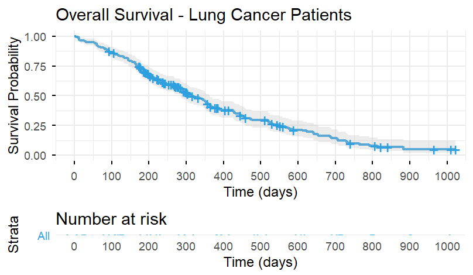
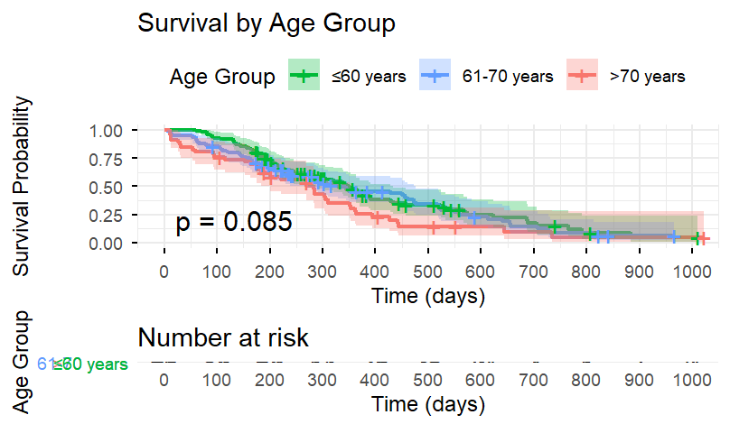
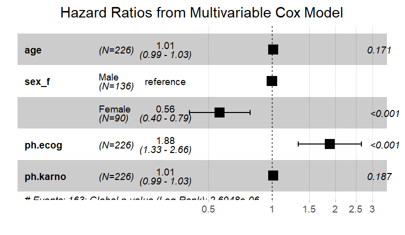

# Introduction to Survival Analysis

## What is Survival Analysis?

**Survival analysis** is a collection of statistical methods for analyzing time-to-event data.

::: {.incremental}
- **Time-to-event**: Duration until a specific event occurs
- Originally developed for studying death (hence "survival")
- Now used broadly: disease progression, equipment failure, customer churn, etc.
:::

## Why Not Use Standard Methods?

::: {.columns}
::: {.column width="50%"}
**Problems with standard methods:**

- Censoring (incomplete observations)
- Non-normal distributions
- Time-dependent covariates
- Interest in hazard rates
:::

::: {.column width="50%"}
**Example:**

A patient enters a study on Day 0 and is followed for 2 years. If they're still alive at the end, we know they survived *at least* 2 years, but not their actual survival time.
:::
:::

## Key Concepts: Censoring

**Censoring** occurs when we have incomplete information about survival time.

## Types of Censoring:

1. **Right censoring** (most common)
   - Event hasn't occurred by end of study
   - Patient lost to follow-up
   - Patient withdraws

2. **Left censoring** (rare)
   - Event occurred before observation began

3. **Interval censoring**
   - Event occurred between two observation times

## Visual Example of Censoring

```
Patient 1: |--------●              Event at 8 months
Patient 2: |---------------●       Event at 15 months  
Patient 3: |--------------------○  Censored at 20 months (study ended)
Patient 4: |----------○            Censored at 10 months (lost to follow-up)
Patient 5: |-----●                 Event at 5 months

Time →     0    5    10   15   20
           ● = Event occurred
           ○ = Censored observation
```

## The Survival Function S(t)

The **survival function** gives the probability of surviving beyond time t:

$$S(t) = P(T > t)$$

Where T is the survival time random variable.

**Properties:**

- S(0) = 1 (everyone alive at start)
- S(∞) = 0 (eventually everyone experiences event)
- S(t) is non-increasing (monotone decreasing)

## The Hazard Function h(t)

The **hazard function** (or hazard rate) is the instantaneous event rate at time t, given survival up to time t:

$$h(t) = \lim_{\Delta t \to 0} \frac{P(t \leq T < t + \Delta t | T \geq t)}{\Delta t}$$

**Interpretation:**

- Risk of event at time t among those who haven't experienced it yet
- Can increase, decrease, or stay constant over time
- Unlike probability, can exceed 1.0

## Survival Data Structure

Each observation requires:

1. **Time**: Duration from start to event or censoring
2. **Status**: Event occurred (1) or censored (0)
3. **Covariates**: Variables that might affect survival (age, treatment, etc.)

## Survival Data Structure (cont.)

**Example:**

| Patient | Time | Status | Treatment | Age |
|---------|------|--------|-----------|-----|
| 1       | 15   | 1      | A         | 45  |
| 2       | 20   | 0      | B         | 52  |
| 3       | 8    | 1      | A         | 38  |

## Common Applications in Biostatistics

::: {.incremental}
- **Clinical trials**: Time to death, disease progression, or relapse
- **Epidemiology**: Time to disease onset
- **Cancer research**: Overall survival, progression-free survival
- **Infectious diseases**: Time to infection or recovery
- **Cardiology**: Time to heart attack or stroke
- **Health economics**: Time to hospital readmission
:::

## Types of Survival Analysis Methods

1. **Non-parametric methods**
   - Kaplan-Meier estimator
   - Log-rank test

2. **Semi-parametric methods**
   - Cox proportional hazards model

3. **Parametric methods**
   - Exponential, Weibull, log-normal models

We'll focus on the first two in this course.


# Kaplan-Meier Curves

## The Kaplan-Meier Estimator

The **Kaplan-Meier (KM) estimator** is a non-parametric method for estimating the survival function from observed survival times.

**Also known as:**
- Product-limit estimator
- KM curve
- Survival curve

**Key advantage:** Handles censored data naturally

## KM Formula

The KM estimate at time t is:

$$\hat{S}(t) = \prod_{t_i \leq t} \left(1 - \frac{d_i}{n_i}\right)$$

Where:

- $t_i$ = distinct event times
- $d_i$ = number of events at time $t_i$
- $n_i$ = number at risk just before $t_i$

The survival probability is the product of conditional survival probabilities.

## Step-by-Step Example

| Time | At Risk | Events | Censored | Survival Probability |
|------|---------|--------|----------|---------------------|
| 0    | 10      | 0      | 0        | 1.0                |
| 3    | 10      | 1      | 0        | 0.9 (9/10)         |
| 5    | 9       | 0      | 1        | 0.9                |
| 7    | 8       | 2      | 0        | 0.675 (0.9 × 6/8)  |
| 10   | 6       | 1      | 0        | 0.563 (0.675 × 5/6)|

Note: Censored observations contribute to "at risk" until their censoring time.

## Interpreting KM Curves

::: {.columns}
::: {.column width="50%"}
**Key features:**

- Y-axis: Survival probability (0 to 1)
- X-axis: Time
- Step function (drops at event times)
- Vertical tick marks = censored observations
- Confidence bands show uncertainty
:::

::: {.column width="50%"}
**What to look for:**

- Median survival time
- Survival at specific timepoints
- Shape of curve (steep vs. gradual decline)
- Comparison between groups
:::
:::

## Median Survival Time

**Median survival** is the time at which 50% of subjects have experienced the event.

- Read from KM curve where S(t) = 0.5
- More robust than mean survival
- May be undefined if <50% experience event
- Preferred in medical literature

**Note:** If the curve never drops below 0.5, median survival is not reached (censored).

## Confidence Intervals

KM estimates come with confidence intervals using:

1. **Greenwood's formula** for standard error
2. **Log-log transformation** for CI construction (most common)
3. **Plain or log transformation** (alternatives)

**Wider CIs occur when:**
- Fewer subjects at risk
- More censoring
- Later time points



## Comparing Survival Curves

When comparing multiple groups (e.g., treatment A vs. B):

**Visual comparison:**
- Separate KM curves on same plot
- Non-overlapping CIs suggest difference
- Crossing curves indicate non-proportional hazards

**Statistical test:**
- Log-rank test (next lecture)
- Tests whether survival distributions differ



## Assumptions of KM Method

1. **Censoring is independent of survival**
   - Censored subjects have same prognosis as those continuing

2. **Survival probabilities are the same for early and late recruits**
   - No time trends in underlying risk

3. **Events occur at specified times**
   - No measurement error in event times

## Limitations of KM Method

::: {.incremental}
- **No covariate adjustment**: Can't control for confounders
- **Descriptive only**: Doesn't quantify effects
- **Limited to categorical comparisons**: Can't use continuous variables
- **Assumes independence**: Issues with competing risks
- **Small sample problems**: Unstable at tail of distribution
:::

**Solution:** Use Cox regression for multivariable analysis

## When to Use KM Curves

**Ideal for:**

- Describing survival experience
- Initial exploratory analysis
- Comparing 2-3 groups visually
- Reporting outcomes in clinical trials
- Communicating with non-statisticians

## When to Use KM Curves (cont.)

**Use with caution:**

- When many covariates need adjustment
- Small sample sizes
- Heavy censoring (>50%)


# Log-Rank Test

## Purpose of the Log-Rank Test

The **log-rank test** is a hypothesis test to compare survival distributions of two or more groups.

**Null hypothesis (H₀):** Survival distributions are the same across groups

**Alternative hypothesis (H₁):** At least one group differs

It's the most common statistical test for comparing survival curves.

## How the Log-Rank Test Works

The test compares:

- **Observed** number of events in each group
- **Expected** number of events if H₀ were true

At each event time:

1. Calculate expected events under H₀
2. Sum over all event times
3. Compute test statistic
4. Compare to chi-square distribution

## Log-Rank Test Statistic

The test statistic follows a chi-square distribution:

$$\chi^2 = \frac{(O - E)^2}{E}$$

For multiple groups:

$$\chi^2 = \sum_{j=1}^{g} \frac{(O_j - E_j)^2}{E_j}$$

- Degrees of freedom = number of groups - 1
- Larger values provide evidence against H₀

## Example Calculation Concept

At each event time t:

**Expected events in group 1:**

$$E_{1t} = \frac{n_{1t}}{n_t} \times d_t$$

Where:
- $n_{1t}$ = at risk in group 1 at time t
- $n_t$ = total at risk at time t  
- $d_t$ = total events at time t

Sum expected and observed across all event times, then compute test statistic.

## Interpreting Log-Rank Results

**P-value interpretation:**

- p < 0.05: Evidence of difference in survival between groups
- p ≥ 0.05: Insufficient evidence of difference

**Important notes:**

- Tests equality of entire survival distributions
- Doesn't specify which group is better
- Doesn't quantify magnitude of difference
- Look at KM curves for direction and clinical significance

## Assumptions of Log-Rank Test

1. **Independent censoring**
   - Censoring unrelated to prognosis

2. **Similar censoring patterns**
   - Censoring mechanisms similar across groups

3. **Proportional hazards** (approximately)
   - Hazard ratio is roughly constant over time
   - Most powerful when this holds

## When Assumptions Are Violated

**Non-proportional hazards:**

- KM curves cross
- Early vs. late effects differ
- Treatment effect changes over time

**Solutions:**

- Weighted log-rank tests (e.g., Peto-Peto, Fleming-Harrington)
- Stratified log-rank test
- Restricted mean survival time comparison
- Report results at specific time points

## Stratified Log-Rank Test

Used when you want to:

- Compare groups **while adjusting** for a categorical variable
- Account for a potential confounder
- Test within strata and combine results

**Example:** Comparing treatments while stratifying by disease stage

**Limitation:** Can only stratify by categorical variables with few levels

## Multiple Group Comparisons

When comparing >2 groups:

1. **Overall test**
   - Single p-value testing any difference
   - Degrees of freedom = groups - 1

2. **Pairwise comparisons**
   - All possible pairs
   - Adjust for multiple testing (e.g., Bonferroni)
   - Or use trend test if groups are ordered

## Log-Rank vs. Other Tests

**Alternatives:**

1. **Wilcoxon test (Breslow)**
   - Gives more weight to early events
   - Better when early differences matter

2. **Tarone-Ware test**
   - Intermediate weighting

3. **Fleming-Harrington family**
   - Flexible weighting schemes

**Most common:** Log-rank test (equal weighting)

## Reporting Log-Rank Results

**Essential elements:**

::: {.incremental}
1. Test statistic and degrees of freedom
2. P-value
3. Sample sizes and event numbers per group
4. Median survival times with CIs
5. KM curve figure
6. Clear statement of findings
:::

**Example:** "The log-rank test showed significantly better survival in the treatment group (χ² = 8.42, df = 1, p = 0.004)."


# Cox Proportional Hazards Model

## Introduction to Cox Regression

The **Cox proportional hazards model** is a semi-parametric regression method for survival data.

**Key features:**

- Most widely used multivariable survival method
- Estimates effects of covariates on hazard
- No assumption about baseline hazard shape
- Can include multiple predictors
- Handles both continuous and categorical variables

## The Cox Model Formula

$$h(t|X) = h_0(t) \times \exp(\beta_1X_1 + \beta_2X_2 + ... + \beta_pX_p)$$

Where:

- $h(t|X)$ = hazard at time t given covariates X
- $h_0(t)$ = baseline hazard (unspecified)
- $\beta$ = regression coefficients
- $X$ = covariate values

The hazard is the product of baseline hazard and exponential function of covariates.

## Why "Proportional Hazards"?

**Proportional hazards assumption:** The hazard ratio between any two individuals is constant over time.

For two subjects with covariate values $X_1$ and $X_2$:

$$\frac{h(t|X_1)}{h(t|X_2)} = \exp[\beta(X_1 - X_2)]$$

This ratio doesn't depend on time t.

**Implication:** Effects are multiplicative on hazard scale

## Interpreting Cox Coefficients

The coefficient $\beta$ represents:

- Log hazard ratio per unit increase in covariate
- Positive $\beta$: Increased hazard (worse survival)
- Negative $\beta$: Decreased hazard (better survival)
- $\beta = 0$: No effect

**Note:** Coefficients are on log scale, so we exponentiate to get hazard ratios (next lecture).



## Categorical Predictors

For categorical variables (e.g., treatment group):

- One category is the reference
- Coefficients represent log hazard ratios vs. reference
- Can have multiple categories (multiple dummy variables)

**Example:** Treatment (A vs. B)

- Reference: Treatment A
- Coefficient for B: log(HR) comparing B to A

## Continuous Predictors

For continuous variables (e.g., age):

- Coefficient is per one-unit increase
- Assume linear relationship with log-hazard
- Can transform if needed (log, polynomial)
- Can categorize, but loses information

**Example:** Age coefficient = 0.05

- Hazard increases 5% per year of age (approximately)

## Multiple Predictors

Cox models can include many predictors simultaneously:

**Advantages:**

- Control for confounding
- Identify independent predictors
- More efficient use of data
- Test interactions

## Multiple Predictors (cont.)

**Considerations:**

- Need adequate sample size (events, not just subjects)
- Rule of thumb: ≥10 events per predictor variable

## Model Building Strategy

1. **Univariable screening**
   - Test each predictor separately
   - Identify candidates (p < 0.2 or clinical importance)

2. **Multivariable model**
   - Include candidate predictors
   - Check proportional hazards assumption
   - Consider interactions
   
## Model Building Strategy (cont.)

3. **Model reduction**
   - Remove non-significant predictors (if appropriate)
   - Compare nested models with likelihood ratio tests

## Time-Dependent Covariates

Standard Cox model: Covariates measured at baseline

**Time-dependent covariates:** Values change during follow-up

**Examples:**

- Transplant status (waiting vs. transplanted)
- Disease status (remission vs. relapse)
- Medication changes

Requires special coding and extended Cox model formulation.

## Stratified Cox Model

When proportional hazards assumption fails for a variable:

**Solution:** Stratify by that variable

- Allows different baseline hazards per stratum
- Estimates common effect for other covariates
- Doesn't estimate effect of stratification variable

**Example:** Stratify by hospital, estimate treatment effect

## Assumptions of Cox Model

1. **Proportional hazards**
   - Hazard ratio constant over time

2. **Linear relationship**
   - Log-hazard linear in continuous predictors

3. **Independence**
   - Observations independent

4. **Correct functional form**
   - Appropriate transformations

## Checking Proportional Hazards

**Methods:**

1. **Graphical**
   - Log-log plots should be parallel
   - Schoenfeld residuals vs. time (flat line)

2. **Statistical**
   - Test correlation of scaled Schoenfeld residuals with time
   - Global test for all covariates
   
## Checking Proportional Hazards (cont.)

**If violated:**

- Stratify on that variable
- Include time interaction
- Use time-varying coefficient model

## Advantages of Cox Model

::: {.incremental}
- **Semi-parametric:** Flexible baseline hazard
- **Robust:** Handles various distributions
- **Multivariable:** Controls for confounding
- **Efficient:** Uses all available data
- **Interpretable:** Hazard ratios
- **Standard:** Widely accepted in medical research
:::

## Limitations of Cox Model

::: {.incremental}
- **Proportional hazards:** May not always hold
- **Complexity:** More assumptions than KM
- **Sample size:** Needs adequate events
- **Non-linearity:** May need transformations
- **No absolute risk:** Only relative comparisons
- **Competing risks:** Needs special handling
:::


# Interpreting Hazard Ratios

## What is a Hazard Ratio?

**Hazard Ratio (HR)** is the ratio of hazards between two groups or for a unit change in a continuous variable.

$$HR = \frac{h_1(t)}{h_0(t)} = \exp(\beta)$$

Where $\beta$ is the Cox regression coefficient.

**Key point:** HR is obtained by exponentiating the coefficient.

## Hazard Ratio Scale

**HR interpretation:**

- **HR = 1**: No difference in hazard
- **HR > 1**: Increased hazard (worse outcome)
- **HR < 1**: Decreased hazard (better outcome)

## Hazard Ratio Scale (cont.)

**Examples:**

- HR = 2.0: Twice the hazard
- HR = 0.5: Half the hazard
- HR = 1.5: 50% increase in hazard
- HR = 0.75: 25% decrease in hazard

## Converting Between Representations

**From coefficient to HR:**

$$HR = e^{\beta}$$

**From HR to coefficient:**

$$\beta = \ln(HR)$$

**Percentage change:**

$$(HR - 1) \times 100\%$$

## Example: Binary Predictor

**Scenario:** Comparing new treatment to standard care

**Cox output:** $\beta = -0.47$, standard error = 0.15

**Calculations:**

- $HR = e^{-0.47} = 0.625$
- 95% CI: $e^{-0.47 \pm 1.96 \times 0.15}$ = (0.47, 0.84)

**Interpretation:** New treatment reduces hazard of death by 37.5% compared to standard care.

## Example: Continuous Predictor

**Scenario:** Effect of age on mortality

**Cox output:** $\beta = 0.03$ per year

**Calculations:**

- HR = $e^{0.03}$ = 1.03 per year
- HR for 10 years = $e^{0.03 \times 10}$ = 1.35

**Interpretation:** Each additional year of age increases hazard by 3%. A 10-year age difference corresponds to 35% increase in hazard.

## Confidence Intervals for HR

**95% CI formula:**

$$e^{\beta \pm 1.96 \times SE(\beta)}$$

**Interpretation:**

- If CI excludes 1.0: Statistically significant
- If CI includes 1.0: Not statistically significant
- Width indicates precision of estimate

**Example:** HR = 0.62 (95% CI: 0.47-0.84)

The effect is significant, and we're 95% confident the true HR is between 0.47 and 0.84.

## P-Values vs. Confidence Intervals

**P-value:**

- Tests H₀: HR = 1
- Dichotomous (significant or not)
- Doesn't show magnitude or precision

**Confidence interval:**

- Shows range of plausible values
- Indicates precision
- Shows clinical significance
- **Preferred for interpretation**

## Common Misinterpretations

::: {.incremental}
1. **"HR = 2 means you'll die twice as fast"**
   - Wrong: It means double the instantaneous risk

2. **"HR = 0.5 means 50% will survive"**
   - Wrong: HR is about rates, not proportions

3. **"HR constant means same absolute benefit"**
   - Wrong: Absolute benefit depends on baseline risk

4. **"Non-significant means no effect"**
   - Wrong: Could be due to small sample size
:::

## Hazard Ratio vs. Risk Ratio

**Hazard Ratio (HR):**

- Compares instantaneous event rates
- From survival analysis
- Accounts for timing

**Risk Ratio (RR):**

- Compares cumulative probabilities
- From standard analysis
- Doesn't account for timing

**Generally:** HR ≠ RR, but often similar in direction

## Adjusted vs. Unadjusted HR

**Unadjusted (crude) HR:**

- Single predictor model
- May be confounded
- Simple interpretation

**Adjusted HR:**

- Multiple predictor model
- Controls for confounders
- "Independent effect"
- Preferred for causal inference

**Example:** Treatment HR = 0.70 (unadjusted) vs. 0.75 (adjusted for age, stage)

## Clinical vs. Statistical Significance

**Statistical significance:**

- Based on p-value or CI
- Depends on sample size
- Mathematical concept

**Clinical significance:**

- Based on magnitude of HR
- Considers context
- Practical importance

## Clinical vs. Statistical Significance (cont.)

**Example:** HR = 0.95 (p = 0.01)

- Statistically significant
- Clinically trivial (5% reduction)

## Number Needed to Treat (NNT)

Unlike odds ratios, you **cannot** easily calculate NNT from HR alone.

**Why?** 

- HR is a relative measure
- NNT is absolute and time-dependent
- Need baseline risk and time horizon

**Solution:** Calculate from survival curves at specific timepoints.

## Effect Modification (Interaction)

**Interaction term:** HR varies by subgroup

**Example:** Treatment × Gender interaction

- HR for treatment in men = 0.60
- HR for treatment in women = 0.85

**Reporting:**

- Main effects alone can be misleading
- Report HR for each subgroup
- Test statistical significance of interaction

## Reporting Hazard Ratios

**Good reporting includes:**

::: {.incremental}
1. Point estimate (HR)
2. 95% confidence interval
3. P-value
4. Reference category (for categorical variables)
5. Adjustment variables (if multivariable)
6. Sample size and number of events
7. Interpretation in context
:::

## Example: Complete Reporting

**Study:** Effect of drug X on mortality in heart failure

**Results:** 

"Treatment with drug X was associated with reduced mortality compared to placebo (adjusted HR = 0.68, 95% CI: 0.53-0.87, p = 0.002) after adjusting for age, sex, and disease severity. Among 500 patients (250 per group), 180 deaths occurred during a median follow-up of 36 months. This represents a 32% reduction in the hazard of death."

## Visualizing Hazard Ratios

**Forest plots:**

- Display multiple HRs with CIs
- Vertical line at HR = 1
- Points to left favor intervention
- Points to right favor control
- Useful for meta-analysis or subgroup analysis

## Visualizing Hazard Ratios (cont.)

**Tips:**

- Use log scale for HR axis
- Include sample sizes
- Order by effect size or clinical logic

## Special Considerations

**Competing risks:**

- Standard HR may be biased
- Use cause-specific or subdistribution hazards
- Interpret carefully

**Non-proportional hazards:**

- HR changes over time
- Report time-specific HRs
- Or use alternative measures (restricted mean)
