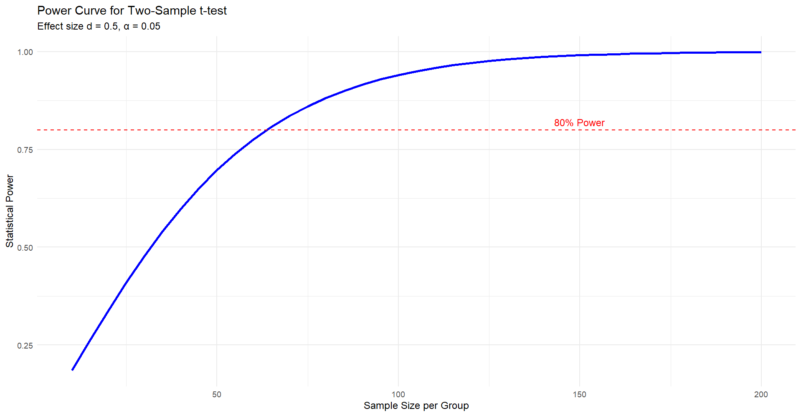
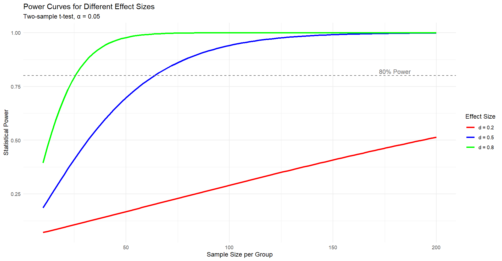

# Why Sample Size is Important

## The Foundation of Good Research

Sample size is not just a number, it's the cornerstone of:

- **Scientific validity**: Can your study detect real effects?
- **Ethical responsibility**: Don't waste resources or participants' time
- **Resource allocation**: Time, money, and personnel
- **Publication success**: Underpowered studies often fail peer review

::: {.callout-warning}
Too small = miss real effects. Too large = waste resources.
:::

---

## Real-World Consequences

**Underpowered Studies:**

- Waste of research funds and participant time
- False negatives (missing real treatments/effects)
- Cannot make definitive conclusions
- May not get published

**Overpowered Studies:**

- Unnecessary cost and time
- Detect trivial effects as "significant"
- Ethical concerns (exposing more participants than needed)

## What Determines Sample Size?

Four key factors work together:

1. **Effect Size**: How big is the difference you expect?
2. **Significance Level (α)**: Usually 0.05 (5% false positive rate)
3. **Statistical Power (1-β)**: Usually 0.80 (80% chance to detect effect)
4. **Variability**: How spread out is your data?

::: {.callout-tip}
If you know any three, you can calculate the fourth!
:::

## Effect Size: The Practical Significance

**What is Effect Size?**

The magnitude of the difference or relationship you're studying.

- **Small effect**: d = 0.2 (subtle differences)
- **Medium effect**: d = 0.5 (noticeable differences)
- **Large effect**: d = 0.8 (obvious differences)

## Effect Size: The Practical Significance (contd.)

**Where do effect sizes come from?**

- Previous literature
- Pilot studies
- Clinical significance thresholds
- Expert opinion

## Sample Size Planning: A Scenario

**Research Question:** Does a new drug lower blood pressure more than placebo?

**Planning Steps:**

1. Expected difference: 10 mmHg (from pilot data)
2. Standard deviation: 15 mmHg (from literature)
3. Effect size: d = 10/15 = 0.67 (medium)
4. Set α = 0.05, power = 0.80
5. **Calculate needed sample size**

This systematic approach prevents "guessing" sample sizes.

# Types of Errors & Power

## The Truth Table of Hypothesis Testing

|                          | **Truth: H₀ True** | **Truth: H₀ False** |
|--------------------------|-------------------|---------------------|
| **Decision: Reject H₀**  | Type I Error (α)  | ✓ Correct           |
| **Decision: Fail to Reject** | ✓ Correct     | Type II Error (β)   |

**Key Points:**

- We can never know the truth with certainty
- We control error rates through study design
- Sample size affects Type II error (β)

## Type I Error (α): False Positive

**Definition:** Rejecting H₀ when it's actually true

**Example:** Concluding a drug works when it actually doesn't

**Typical Setting:** α = 0.05 (5%)

- This means: 5% chance of false positive
- Controlled by significance level
- Multiple testing increases Type I error

::: {.callout-important}
α is set **before** conducting the study and remains fixed.
:::

## Type II Error (β): False Negative

**Definition:** Failing to reject H₀ when it's actually false

**Example:** Concluding a drug doesn't work when it actually does

**Typical Setting:** β = 0.20 (20%)

- This means: 20% chance of missing real effect
- Affected primarily by sample size
- Also affected by effect size and variability

::: {.callout-note}
β decreases as sample size increases.
:::

## Statistical Power (1 - β)

**Definition:** Probability of correctly rejecting H₀ when it's false

**Power = 1 - β**

- If β = 0.20, then Power = 0.80 (80%)
- This means: 80% chance of detecting a real effect

**Conventional Standards:**

- Minimum acceptable: 80% (0.80)
- Preferable: 90% (0.90)
- High power: 95% (0.95)

## Factors Affecting Power

**Power increases when:**

1. **Sample size increases** ↑ (most controllable)
2. **Effect size increases** ↑ (nature of phenomenon)
3. **Significance level (α) increases** ↑ (but increases false positives)
4. **Variability decreases** ↓ (better measurement, homogeneous sample)

**The Trade-off:**

Higher power requires larger sample size or accepting more Type I errors.

## Power Curves: Visualizing Relationships

**What Power Curves Show:**

- How power changes with sample size
- The "diminishing returns" of larger samples
- How effect size impacts required sample size

**Typical Pattern:**

- Steep increase initially
- Levels off at larger sample sizes
- Different curves for different effect sizes

## Power Curves: Visualizing Relationships (cont.)

## Balancing Errors: The Research Context

**Medical Screening (e.g., cancer):**

- Type II error more serious (missing disease)
- May set α = 0.10 to reduce β
- Accept more false positives to catch more cases

**Drug Approval:**

- Type I error more serious (approving ineffective/harmful drug)
- Keep strict α = 0.05 or lower
- Require high power (90%+)

::: {.callout-tip}
Context determines which error is more costly.
:::

# Power Analysis in R

## The `pwr` Package: Your Power Analysis Toolkit

**What It Does:**

- Calculates power for various statistical tests
- Determines required sample size
- Computes detectable effect size
- Creates power curves and visualizations

## The `pwr` Package: Your Power Analysis Toolkit (contd.)

**Key Functions:**

- `pwr.t.test()` - t-tests
- `pwr.anova.test()` - ANOVA
- `pwr.chisq.test()` - Chi-square tests
- `pwr.p.test()` - Proportion tests

## The Four-Parameter Relationship

In any power analysis, you provide **three** parameters and calculate the **fourth**:

1. **n** = sample size per group
2. **d** = effect size (Cohen's d for t-tests)
3. **sig.level** = α (usually 0.05)
4. **power** = 1 - β (usually 0.80)

::: {.callout-tip}
**Most common:** Specify effect size, α, and power → Calculate n
:::

## Power Analysis Workflow

**Step 1: Define Your Research Question**

- What comparison are you making?
- What type of test will you use?

**Step 2: Determine Effect Size**

- From literature review
- From pilot data
- From clinical significance

## Power Analysis Workflow (contd.)

**Step 3: Set Error Rates**

- Choose α (typically 0.05)
- Choose desired power (typically 0.80)

**Step 4: Calculate Sample Size**

- Use appropriate `pwr` function

## Interpreting Power Analysis Results

**Sample Output Structure:**

- Test type and design
- Sample size per group (n)
- Effect size (d, f, w, h)
- Significance level (α)
- Power (1 - β)
- Alternative hypothesis

## Interpreting Power Analysis Results (contd.)

**What to Report:**

"A sample size of 64 per group provides 80% power to detect a medium effect (d = 0.5) at α = 0.05."

---

## Creating Power Curves

**Why Power Curves?**

- Visualize relationship between sample size and power
- Show "point of diminishing returns"
- Compare different effect sizes
- Aid in decision-making

## Creating Power Curves (contd.)

**What They Show:**

- X-axis: Sample size
- Y-axis: Statistical power
- Multiple curves for different effect sizes
- Reference line at 0.80 power

## Creating Power Curves (contd.)

## Sensitivity Analysis

**Why Do It?**

Effect sizes are estimates—they're uncertain!

**Approach:**

1. Calculate sample size for expected effect (e.g., d = 0.5)
2. Calculate power for smaller effect (e.g., d = 0.3)
3. Calculate power for larger effect (e.g., d = 0.7)

**Benefit:**

Understand how robust your study is to effect size misspecification.

# Determining Sample Size for t-tests

## Types of t-tests and Sample Size

**Three Designs, Three Approaches:**

1. **Independent samples t-test**
   - Two separate groups
   - n per group

2. **Paired samples t-test**
   - Same subjects measured twice
   - n = number of pairs
   
## Types of t-tests and Sample Size (contd.)

3. **One-sample t-test**
   - Compare sample mean to known value
   - n = total sample size

## Independent Samples t-test

**Research Scenario:**

Comparing treatment group vs. control group

**Key Parameters:**

- **d** = Cohen's d = (μ₁ - μ₂) / σ
- **sig.level** = typically 0.05
- **power** = typically 0.80
- **type** = "two.sample"
- **alternative** = "two.sided" (or "greater", "less")

## Independent Samples t-test (contd.)

**Result:**

n per group needed

## Cohen's d: Standardized Effect Size

**Formula:** d = (Mean₁ - Mean₂) / Pooled SD

**Interpretation:**

- **d = 0.2**: Small effect (subtle difference)
- **d = 0.5**: Medium effect (moderate difference)
- **d = 0.8**: Large effect (substantial difference)

**Example:**

If Treatment mean = 120, Control mean = 110, SD = 20:

d = (120 - 110) / 20 = 0.5 (medium effect)

## One-Sided vs Two-Sided Tests

**Two-Sided (default):**

- H₁: μ₁ ≠ μ₂ (means are different)
- No prediction of direction
- More conservative
- **Requires larger sample size**

## One-Sided vs Two-Sided Tests (contd.)

**One-Sided:**

- H₁: μ₁ > μ₂ or μ₁ < μ₂ (directional)
- Stronger prediction
- **Requires smaller sample size**
- Justified when direction is certain

## Paired Samples t-test

**Research Scenario:**

Before-after measurements, matched pairs

**Key Difference:**

- Calculate d based on **difference scores**
- d = Mean difference / SD of differences
- Generally more powerful (needs fewer participants)

## Paired Samples t-test (contd.)

**Advantage:**

Controls for individual variability, reducing error variance.

## One-Sample t-test

**Research Scenario:**

Compare sample mean to known population value

**Example:**

"Is the average IQ of medical students different from 100?"

## One-Sample t-test (contd.)

**Key Parameters:**

- **d** = (Sample mean - Population mean) / SD
- **type** = "one.sample"
- Power analysis gives total n needed

## Sample Size Tables: Quick Reference

**For two-sample t-test at α = 0.05, power = 0.80:**

| Effect Size | n per group |
|-------------|-------------|
| d = 0.2     | 393         |
| d = 0.3     | 175         |
| d = 0.5     | 64          |
| d = 0.8     | 26          |

**Key Insight:** Small effects require dramatically larger samples!

## Practical Considerations for t-tests

**Plan for Attrition:**

- Add 10-20% to account for dropouts
- If n = 64 needed, recruit 77 (20% buffer)

**Unequal Group Sizes:**

- Power calculations assume equal n
- Unequal groups reduce power
- Use harmonic mean if groups differ

## Practical Considerations for t-tests (contd.)

**Multiple Comparisons:**

- Each additional comparison increases Type I error
- May need Bonferroni correction (α/k)
- Reduces power, increases needed sample size

# Sample Size for Proportion Tests

## When to Use Proportion Tests

**Research Scenarios:**

- Comparing success rates between groups
- Testing if proportion differs from known value
- Binary outcomes (yes/no, success/failure)

## When to Use Proportion Tests (contd.)

**Examples:**

- Vaccination efficacy (infected vs. not infected)
- Treatment success rates
- Survey responses (agree vs. disagree)
- Diagnostic test accuracy

## Two-Proportion Test

**Research Question:**

Do two groups have different proportions of success?

**Example:**

- Group 1: 60% success rate
- Group 2: 40% success rate
- Are these significantly different?

## Two-Proportion Test (contd.)

**Parameters:**

- **p₁** = proportion in group 1
- **p₂** = proportion in group 2
- **sig.level** = α
- **power** = 1 - β

## Effect Size for Proportions: Cohen's h

**Formula:** h = 2(arcsin√p₁ - arcsin√p₂)

**Interpretation:**

- **h = 0.2**: Small effect
- **h = 0.5**: Medium effect
- **h = 0.8**: Large effect

::: {.callout-note}
Cohen's h accounts for the fact that proportions near 0 or 1 have less variability.
:::

## One-Proportion Test

**Research Question:**

Does sample proportion differ from known population proportion?

**Example:**

- National vaccination rate: 70%
- Your community: 65%
- Is this significantly different?

## One-Proportion Test (contd.)

**Parameters:**

- **h** = effect size
- **p₀** = null hypothesis proportion
- **sig.level** = α
- **power** = 1 - β

## Sample Size Requirements: Proportions

**Two-Proportion Test at α = 0.05, power = 0.80:**

| p₁ - p₂ | Approximate n per group |
|---------|------------------------|
| 0.05    | 1,571                  |
| 0.10    | 393                    |
| 0.15    | 175                    |
| 0.20    | 99                     |
| 0.30    | 45                     |

**Key Point:** Detecting small differences in proportions requires large samples!

## Special Case: Proportions Near 0 or 1

**Challenge:** When proportions are near boundaries (0% or 100%), variance is smaller.

**Implications:**

- May need smaller sample sizes
- But harder to detect differences
- More sensitive to assumptions

**Example:** Comparing 95% vs. 90% success rate requires fewer participants than 55% vs. 50%.

## Continuity Correction

**Issue:** Proportions are discrete, but tests use continuous approximations.

**Solution:** Apply continuity correction when:

- Expected cell counts are small (< 5)
- Proportions very close to 0 or 1
- Small sample sizes

::: {.callout-tip}
Most power analysis functions include options for continuity correction.
:::

## Practical Examples: Proportion Tests

**Clinical Trial:**

"Does new drug reduce infection rate from 20% to 10%?"

- p₁ = 0.20, p₂ = 0.10
- Difference = 0.10 (10 percentage points)
- Calculate h and required n

**Survey Research:**

"Do men and women differ in vaccination acceptance?"

- Estimate p₁ and p₂ from pilot or literature
- Power analysis for two-proportion test

## Matched Pairs: McNemar's Test

**When to Use:**

Before-after comparisons with binary outcomes

**Example:**

- Before training: 40% pass certification
- After training: 60% pass certification
- Same individuals tested twice

**Different Analysis:**

Uses discordant pairs, not just proportions. Requires different power calculation approach.

## Summary: Proportion Tests

**Key Takeaways:**

1. Use Cohen's h for effect size
2. Small differences need large samples
3. Consider proportions near boundaries
4. Account for matched/paired designs
5. Always plan for attrition

**Common Mistake:**

Using t-test formulas for proportion data, proportions have different variance structure!
